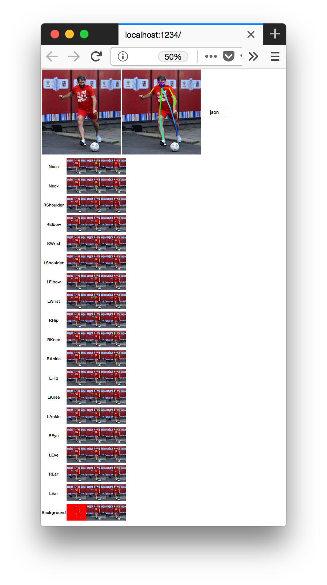

## 00 environment
### python
```
$ python --versions
Python 3.x.x
```
### yarn
```
$ yarn --version
1.5.1
```

### tensorflowjs
```
$ pip install tensorflowjs
```
> MacOS X 10.11+ (?)
>
>```
>$ pip uninstall tensorflow
>$ pip install -Iv tensorflow==1.5
>```

## 01 convert
```
$ yarn tfjs
```

## 02 Web
```
$ yarn
$ yarn watch
```


## 03 Clean
```
$ yarn clean
```
